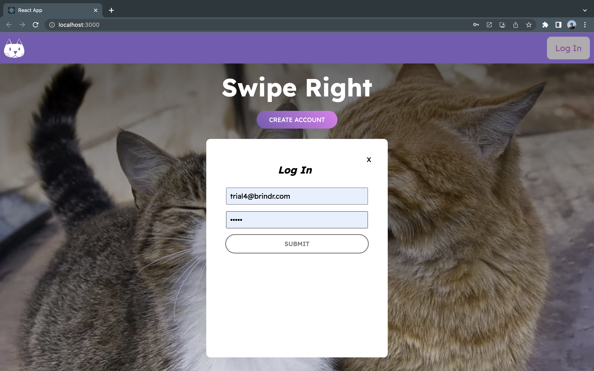
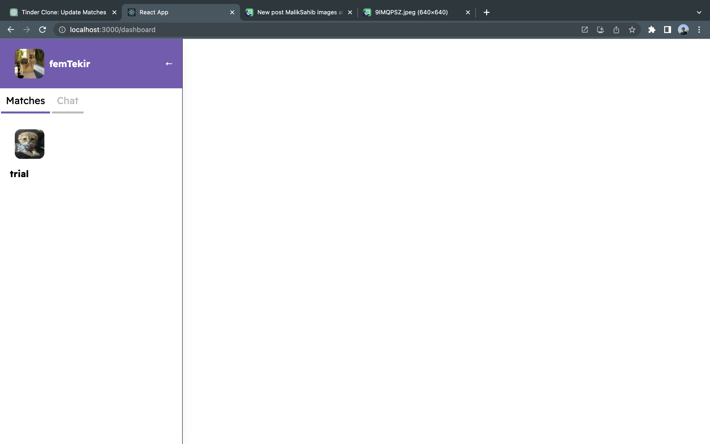
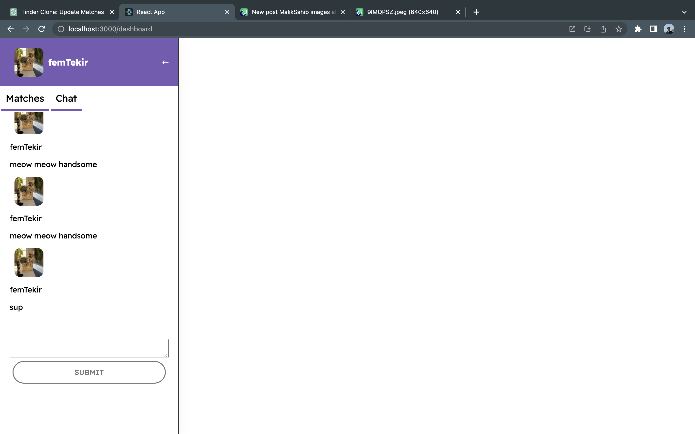
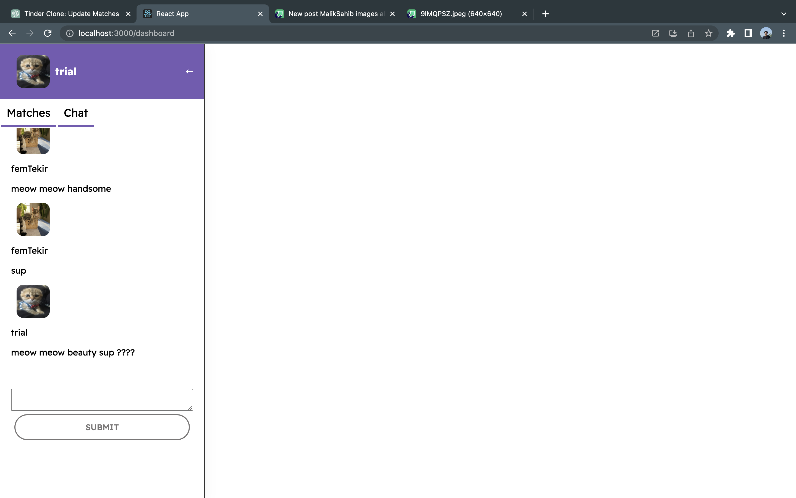

# Brindr Dating and Breed Matching Application for Cats 


## Tech Stack  
----------------------------------------------------------------
    Frontend : React,Javascript,HTML,CSS,
    Backend : MongoDB,Nodejs,Express.js
    
## FRONT END
----------------------------------------------------------------
### ROUTES AND PAGES

* '/' : `Home Page` .In this page user gets acces  to either login or     signup sections.Both login and signup sections are components that are used in this page.

*  '/onboarding' : `Onboarding Page`. In this page user can set up  his or her account.On this page  breed interesd of the user is selected so that user gets to see cats only he or she is interested in.

*  '/dashboard' : `Dashboard Page`. In this page user has access to like or dislike the other users.User can swipe right or left if the user and the corresponding user liked each other, matched user is shown in the matches section.User can click the matched users photo and switch to chatting with other user.


## BACKEND
----------------------------------------------------------------
### ENDPOINTS
  
  * **POST** `/signup` : Receives email and password in the req.body and hashes the password.Checks if the user exists if not adds the user to the DB.Creates a token for 24 hours and sends it back with the user data and 201 message.
  
  * **POST** `/login` : Receives email and password in the req.body.Checks if the user exists and checks if the password is correct with bcrypt.Returns logintoken with user data with 201 message
  
  * **GET**  `/preferredusers` : Gets the gender of the user and preferred breeds in the req.query.Checks the database for parameters and returns the users matching those parameters.
  
  * **PUT**  `/user` : Recieces formdata in req.body and updates the userdata for the given user_id.
  
  *  **GET**  `/user` : Returns the user data for the given user_id in the req.query.Returns only one user.
  
  * **PUT** `/addmatch` : Receives user_id and matchedUserId from req.body.Adds the matchedUserId to the matches array of the given user_id.
  
  * **GET** `/users` : Receives the userIds array in the req.body .Returns the datas of the matched users in the array.
  
  * **GET** `messages` : Receives userId and correspondingUserId in req.query.Returns the messages that userId sent to corresponding userId.
  
  * **POST** `/messages` : Receives message object from req.body. Adds it into the messages collection in the database.

  ## PICTURES
  ----------------------------------------------------------------
### Home Page
 

### LOGIN 
 

### OnBoarding Page


### DashBoard Page


### DashBoard Page 2


### Match


### Chat


### Chat 2

 
---------------------------------------------------------------------

## Setup

  Clone the project to your local computer.

  ````
    cd client
    npm install
    npm start 
  ````
  Go to client directory and install client dependencies and then start the frontend.

  ````javascript
    cd server
    npm install
    nodemon index.js 
  ````
  Go to server directory and install server dependencies and then start the backend server.

  

